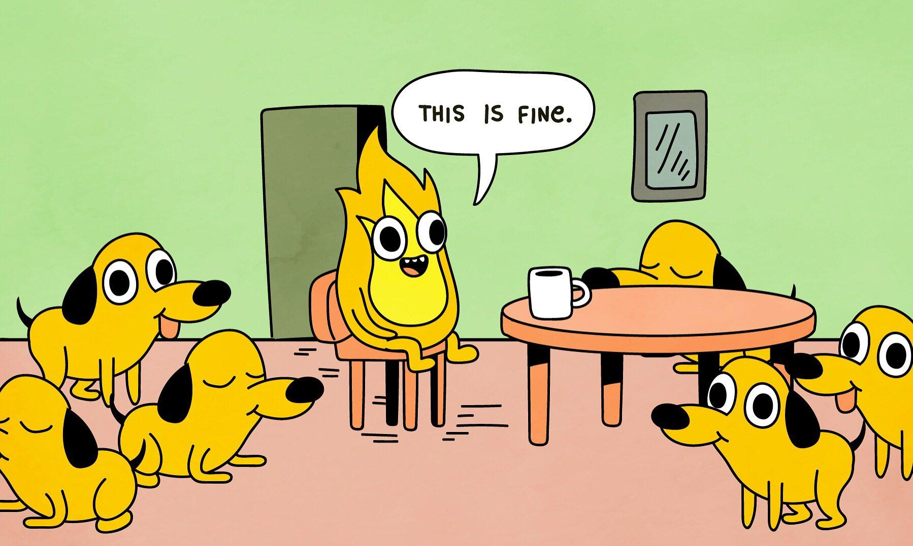

# DuckTapeVideos
DuckTapeVideos is an AI music video generation pipeline. It will take songs via .mp3 and turn them into a music video with AI images from Stable Diffusion stitched together via Deforum in an ephimeral environment built with Pulumi on TouchDesigner.

## MVP: Minimal Viable Product

Pipeline taking a beat, determine BPMs, create a template for prompts based on those BPMs, and then create a video of those prompts via Deforum/StableDiffusion

## Tech Stack (Needs)

- Docker
- Python
- Pulumi
- AWS
- Touch Designer
- Stable Diffusion
  - Deforum Plugin
    - https://github.com/deforum-art/deforum-stable-diffusion
- Boogie 
  - https://lewington-pitsos.github.io/tools/boogie.html
- Lexica
  - https://lexica.art/

------

## Brain Dump (Wants)

- S3 Front End
- CloudFront
- Website

## Backlog

- Discord Bot
- Twitch Bot

---

